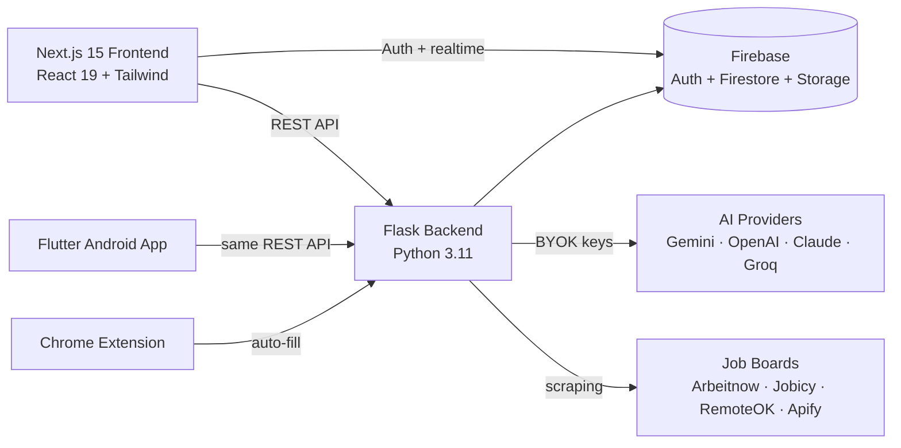

<div align="center">

# 🚀 CareerCraft

### The AI-powered hiring platform where candidates get hired and recruiters find real, verified talent.

**Job search · AI resume builder · Voice interviews · Social feed · Recruiter tools — all in one app, running on *your own* AI keys.**

[Live Demo](https://careercraft-frontend-u7h4zjepfq-uc.a.run.app) · [Full Documentation](docs/DOCUMENTATION.md) · [Technical Deep-Dive](docs/TECHNICAL.md)

</div>

---

## 🤔 What is this? (the simple version)

Imagine LinkedIn, Indeed, and a career coach had a baby — and the baby didn't charge you a subscription.

- **If you're looking for a job:** upload your resume once. CareerCraft reads it, builds you a beautiful resume, finds matching jobs across the internet, applies for you, and even lets you **practice interviews with an AI that talks back**.
- **If you're hiring:** post a job in 4 easy steps, add "knockout questions" that automatically filter out people who don't qualify, and manage all your applicants on one screen.
- **The magic trick:** every AI feature runs on **your own free API key** (like a Gemini key from Google — takes 2 minutes to get). CareerCraft never charges you for AI.

---

## 🎬 See it in action

> **Note:** move the two GIF files from your Downloads folder into `docs/gifs/` for these to display.

**A candidate's day — Dashboard → Browse Jobs → Feed → Resume Builder:**


**Finding people — Network directory → Messages:**


---

## ✨ Everything inside

| For Candidates 👩‍💻 | For Recruiters 🧑‍💼 | For Admins 🛡️ |
|---|---|---|
| AI Resume Builder with live preview & ATS score | 4-step job posting wizard with AI-written descriptions | Feature flags — turn any feature on/off platform-wide |
| Smart Apply — scrapes job boards & applies for you | Screening questions with automatic knockout filtering | User management (suspend/reinstate) |
| AI Voice Interview practice (it actually talks) | Applicant pipeline (Applied → Hired kanban) | Job moderation across the whole platform |
| Proctored interviews with ID verification | AI Copilot candidate search | Live platform statistics |
| Social feed — post, like, comment | Passive sourcing across external job boards | |
| Network — connect & chat with recruiters | Webhooks for ATS integration | |

Plus: **Android app** (Flutter), **Chrome extension** for auto-filling job applications, dark/light themes, and a fully responsive design.

---

## 🏁 Run it on your computer (step by step)

You need three free things installed first:
1. **Node.js** (version 18+) — [download here](https://nodejs.org) → this runs the website
2. **Python** (version 3.11+) — [download here](https://python.org) → this runs the brain (backend)
3. A **Firebase project** (free) — [create one here](https://console.firebase.google.com) → this stores the data

### Step 1 — Get the code
```bash
git clone https://github.com/Sree8778/CareerCraft.git
cd CareerCraft
```

### Step 2 — Start the brain (backend)
```bash
cd web/backend
pip install -r requirements.txt
python app.py
```
✅ You should see: `Firebase Admin SDK successfully initialized` and the server running on port 5000.
*(Needs `credentials.json` from Firebase → Project Settings → Service Accounts → Generate new private key.)*

### Step 3 — Start the website (frontend)
Open a **second** terminal:
```bash
cd web
npm install
npm run dev
```
✅ Open **http://localhost:3000** in your browser. You should see the CareerCraft landing page.
*(Needs a `.env.local` file in `web/` with your Firebase web keys — copy `.env.example` and fill in the values from Firebase → Project Settings → Your apps.)*

### Step 4 — Create an account & add your AI key
1. Click **Try it Free** → sign up as a Candidate or Recruiter
2. Get a free Gemini API key: [aistudio.google.com/apikey](https://aistudio.google.com/apikey) (2 minutes, no credit card)
3. In CareerCraft: **Settings → API Keys → paste your key → Add Key**

That's it. Every AI feature now works. 🎉

---

## 🧭 How to use it

### As a candidate (finding a job)
1. **Upload your resume** in Resume Builder — the AI reads it and fills every section automatically
2. Check your **ATS score** and follow the "Path to 100%" fixes
3. **Browse Jobs** or turn on **Smart Apply** to search job boards and apply in one click
4. **Practice interviews** in Practice Mode — a voice AI asks real questions about your target role
5. Track everything in **My Applications** (drag cards as your status changes)

### As a recruiter (hiring someone)
1. **Requisitions → New Requisition** — the 4-step wizard: role details → description (AI writes it) → screening questions → preview & publish
2. Add **knockout questions** (e.g. "Are you authorized to work here?") — wrong answers filter out automatically
3. Watch applicants land in **Applications** — review, shortlist, schedule interviews
4. Find passive talent with **Passive Sourcing** and **AI Copilot search**

### As the admin
Log in with an admin email (set via `SUPER_ADMIN_EMAILS`) → a **Super Admin** link appears in your sidebar → toggle features, manage users, moderate jobs.

---

## 🔧 The technical stuff

### Architecture (how the pieces talk)



### Tech stack

| Layer | Technology |
|---|---|
| Frontend | Next.js 15 (App Router), React 19, TypeScript, Tailwind CSS, Framer Motion |
| Backend | Flask (Python 3.11), Gunicorn, Firebase Admin SDK |
| Database | Cloud Firestore (NoSQL) + Firebase Storage |
| Auth | Firebase Authentication (email + Google) |
| AI | Bring-Your-Own-Key router: Gemini, OpenAI, Claude, Groq, NVIDIA — with automatic fallback |
| Mobile | Flutter (Android/iOS) |
| Hosting | Google Cloud Run (Docker), deployed via `deploy.ps1` |

### Project layout
```
├── web/               # Next.js frontend
│   ├── src/app/       #   pages (candidate/, recruiter/, admin/, feed/)
│   ├── src/components/#   shared UI (sidebars, cards, navbar)
│   └── backend/       # Flask API (routes.py = all endpoints)
├── mobile/            # Flutter app
├── chrome-extension/  # auto-apply browser plugin
├── firestore.rules    # database security rules
└── deploy.ps1         # one-command Cloud Run deployment
```

### Key environment variables

| Variable | Where | What it does |
|---|---|---|
| `NEXT_PUBLIC_FIREBASE_*` | `web/.env.local` | Connects the website to your Firebase |
| `BACKEND_VAULT_MASTER_KEY` | backend env | Encrypts stored user API keys (Fernet) |
| `SUPER_ADMIN_EMAILS` | backend env | Comma-separated admin allowlist |
| `API_BASE` | mobile build flag | Points the Android app at your backend |

### Deploying to the internet
```powershell
firebase deploy --only firestore:rules   # database security first
.\deploy.ps1                             # builds + deploys backend & frontend to Cloud Run
```

---

## 🆘 Something's not working?

| Problem | Fix |
|---|---|
| "AI features require your API keys" toast | Settings → API Keys → add a free Gemini key |
| Website loads but no jobs/data appear | Is the backend running? (`python app.py` in `web/backend`) |
| Blank screen after login | Wait 2–3 seconds (auth loads) — a skeleton should appear, then the app |
| Mobile app shows no data | Build with `--dart-define=API_BASE=http://YOUR_PC_IP:5000/api` while testing locally |
| `npm ci` fails in Docker | `package.json` and `package-lock.json` are out of sync — run `npm install` and commit the lockfile |

---

<div align="center">

Built with ❤️ by **Sree Ram Varma** · [Full technical documentation →](docs/TECHNICAL.md)

</div>
