# CareerCraft — AI-Powered Recruitment Platform

<div align="center">

**A production-grade, full-stack recruitment platform that automates every stage of the hiring lifecycle using conversational AI, biometric verification, and semantic search — powered entirely by the user's own API keys.**

[](https://careercraft-frontend-brkwttcaqq-uc.a.run.app)
[](https://careercraft-backend-brkwttcaqq-uc.a.run.app)
[](https://github.com/Sree8778/CareerCraft)

</div>

---

## Table of Contents

1. [What is CareerCraft?](#1-what-is-careercraft)
2. [High-Level Architecture](#2-high-level-architecture)
3. [BYOK — Bring Your Own Key System](#3-byok--bring-your-own-key-system)
4. [AI Router — Multi-Provider Fallback Engine](#4-ai-router--multi-provider-fallback-engine)
5. [User Onboarding Flow](#5-user-onboarding-flow)
6. [Candidate Features & Workflows](#6-candidate-features--workflows)
   - [Resume Builder](#61-ai-resume-builder)
   - [Job Search & Application](#62-job-search--application)
   - [AI Voice Practice Interview](#63-ai-voice-practice-interview)
   - [Live Proctored Interview](#64-live-proctored-interview)
   - [Messaging & Network](#65-messaging--ecosystem-network)
7. [Recruiter Features & Workflows](#7-recruiter-features--workflows)
   - [Job Requisitions](#71-job-requisitions--pipeline)
   - [Candidate Management](#72-candidate-management)
   - [AI Copilot Search](#73-ai-copilot-candidate-search)
   - [Interview Scheduling](#74-interview-scheduling)
   - [Webhooks & ATS Integration](#75-webhooks--ats-integration)
8. [Backend API Reference](#8-backend-api-reference)
9. [Database Schema](#9-database-schema)
10. [Tech Stack](#10-tech-stack)
11. [Project Structure](#11-project-structure)
12. [Local Development Setup](#12-local-development-setup)
13. [Production Deployment](#13-production-deployment)
14. [Environment Variables](#14-environment-variables)
15. [Security Architecture](#15-security-architecture)

---

## 1. What is CareerCraft?

CareerCraft is a complete hiring platform that replaces traditional job boards and manual recruiting processes with AI-driven automation at every step. It serves two types of users simultaneously:

| Role | What they get |
|---|---|
| **Candidate** | AI resume builder, semantic job search, cover letter generation, ATS scoring, voice AI practice interviews, live proctored interviews, professional networking |
| **Recruiter** | Job posting management, AI-parsed candidate resumes, semantic copilot search, application kanban pipeline, automated interview scheduling, email notifications, webhook ATS sync |

**What makes CareerCraft different:**

- **Zero shared AI cost** — Every AI feature runs on the user's own API key. CareerCraft never pays for AI usage; it scales to unlimited users without infrastructure AI costs.
- **Multi-provider resilience** — If one AI provider rate-limits, the system silently falls through to the next key or provider with no user-visible error.
- **End-to-end automation** — From resume upload → AI parse → job match → apply → AI interview → offer email, the entire pipeline can run with minimal manual intervention.
- **Voice-first interview experience** — The practice interview is a real-time conversational voice session with a human-sounding AI interviewer that reacts to what the candidate actually said, maintains full conversation context, and asks targeted questions based on the specific job description.

---

## 2. High-Level Architecture

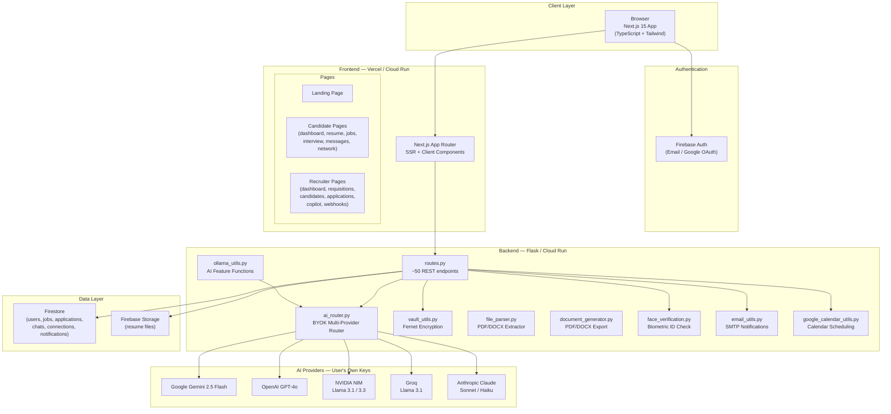

---

## 3. BYOK — Bring Your Own Key System

Every user stores their own AI provider API keys, encrypted in their profile. No shared server key is used for user-facing AI features.

### How it works end-to-end

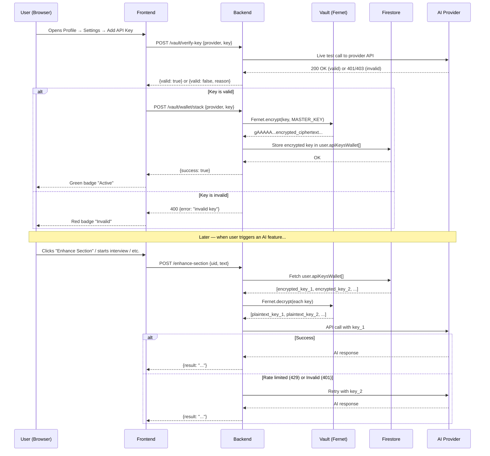

### Supported Providers

| Provider | Verify Method | Light Model | Heavy Model | Notes |
|---|---|---|---|---|
| **Google Gemini** | Live `generateContent` call | `gemini-2.5-flash` | `gemini-2.5-flash` | Free tier available |
| **OpenAI** | Live `chat/completions` call | `gpt-4o-mini` | `gpt-4o` | Best quality |
| **NVIDIA NIM** | Live inference call | `llama-3.1-8b-instruct` | `llama-3.3-70b-instruct` | OpenAI-compatible endpoint |
| **Groq** | Live `chat/completions` call | `llama-3.1-8b-instant` | `llama-3.1-70b-versatile` | Fastest inference |
| **Anthropic Claude** | Live `messages` call | `claude-haiku-4-5` | `claude-sonnet-4-6` | Most nuanced |

### Key status badges

```
● Active     → Key passed live API test, stored encrypted
● Invalid    → Key failed test (expired / wrong key)  → "remove & re-add"
● Exhausted  → Key hit rate limit (429)               → add another key
```

---

## 4. AI Router — Multi-Provider Fallback Engine

`web/backend/ai_router.py` is the core engine that makes all AI features resilient.

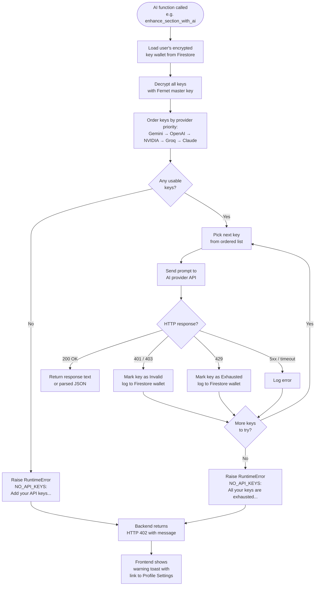

### JSON mode vs text mode

The router handles two response types:

- **Text mode** (`json_mode=False`) — used for interview responses, cover letters, elevator pitches. Returns raw string.
- **JSON mode** (`json_mode=True`) — used for resume parsing, ATS grading, evaluation scores. Includes `_repair_json()` that handles truncated JSON, unclosed braces, and markdown code fences from different models.

### Provider-specific handling

```python
# NVIDIA NIM doesn't support response_format or top_p on all models
is_nvidia = "nvidia" in endpoint
if not is_nvidia:
    payload["top_p"] = 1
if json_mode and not is_nvidia:
    payload["response_format"] = {"type": "json_object"}
```

---

## 5. User Onboarding Flow

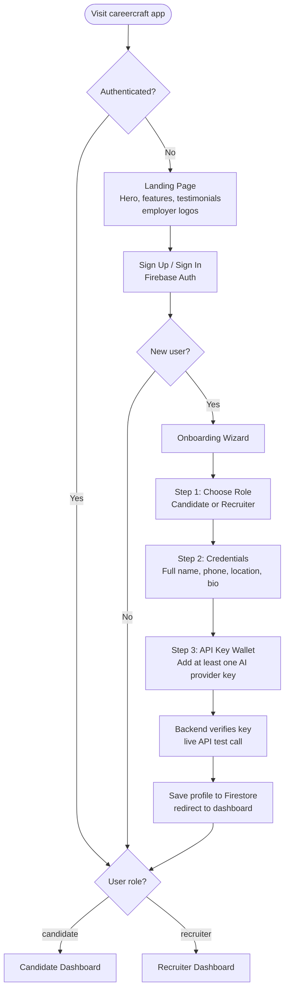

---

## 6. Candidate Features & Workflows

### Candidate Dashboard Overview

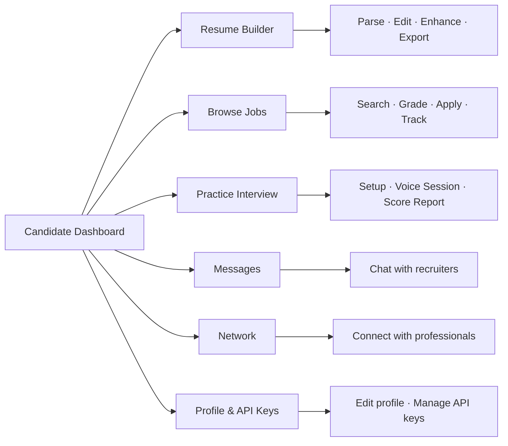

---

### 6.1 AI Resume Builder

The resume builder is a full structured resume editor backed by AI parsing, AI enhancement, and professional document export.

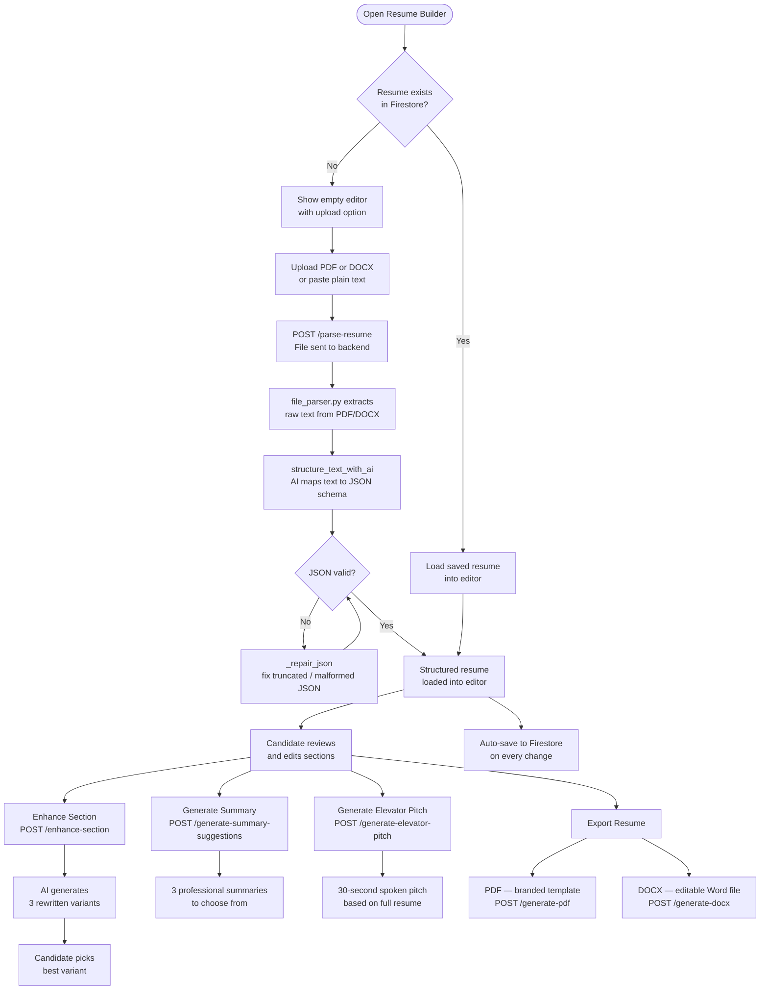

**Resume sections supported:**
- Personal Info (name, email, phone, location, legal status)
- Professional Summary
- Work Experience (with AI-enhanced bullet points in HTML)
- Education (degree, institution, GPA, achievements)
- Skills (grouped by category)
- Projects
- Publications
- Certifications

---

### 6.2 Job Search & Application

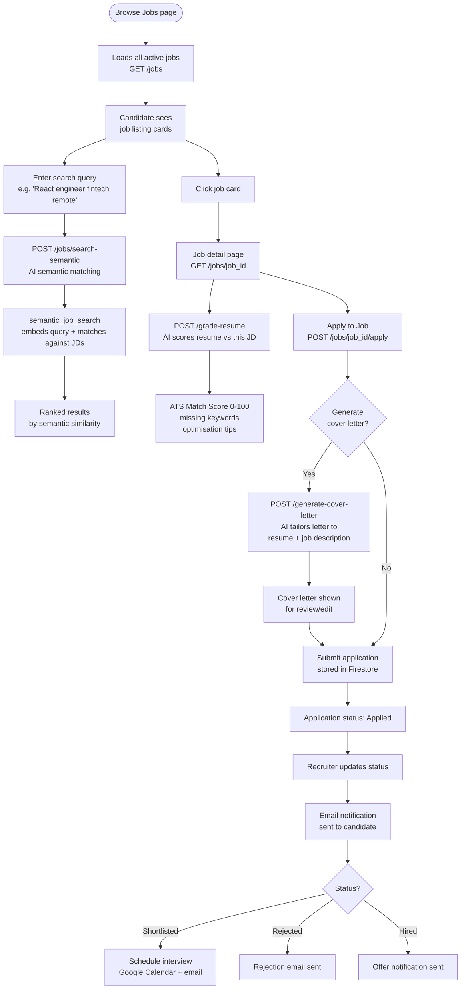

**Application pipeline stages:**
```
Applied → In Review → Interviewed → Shortlisted → Hired
                                  ↘ Rejected
```

---

### 6.3 AI Voice Practice Interview

The most sophisticated feature — a real-time voice conversation with an AI interviewer that sounds and behaves like a human.

#### Setup Flow

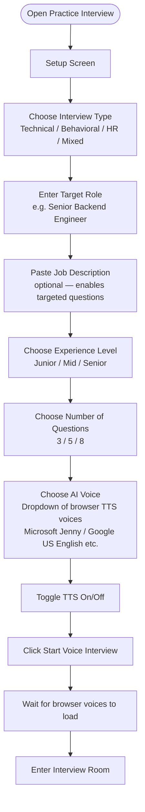

#### Interview Session Flow

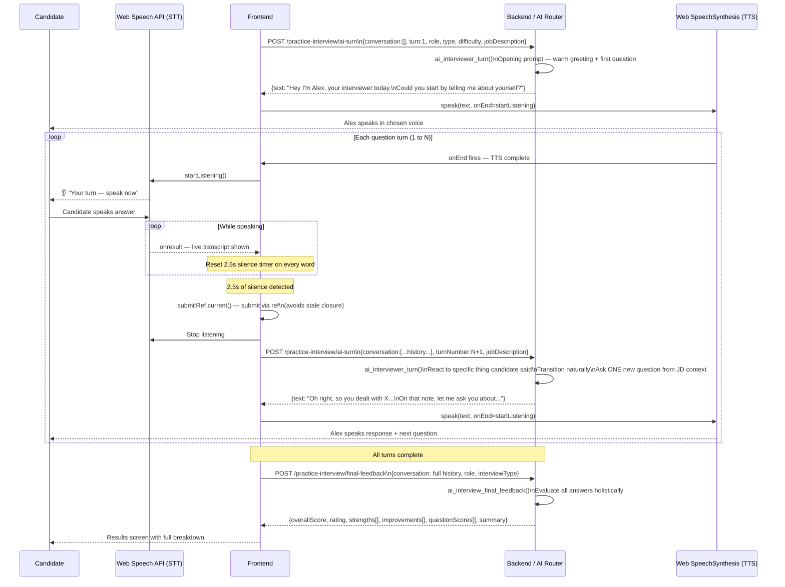

#### Technical challenges solved

| Problem | Root Cause | Solution |
|---|---|---|
| AI losing context after turn 1 | Stale closure — `startListening` captured `submitUserAnswer` at creation, always saw `currentTurn = 0` | Replace `currentTurn` state with `turnRef` (useRef); route all silence-timer callbacks through `submitRef.current` |
| No audio after first TTS | Chrome SpeechSynthesis pauses silently after ~14s | `setInterval` keepalive calls `speechSynthesis.resume()` every 5s; 120ms delay after `cancel()` before new utterance |
| AI asking two questions | Model follows numbered-list prompt structure as parallel tasks | Restructured prompt to "3 sentences" format; added "exactly ONE question mark" strict rule; backend safety net truncates after 2nd `?` |
| Response truncated mid-sentence | `Alex:` / `Candidate:` speaker labels triggered model's conversational stop tokens | Changed history format to `[INTERVIEWER]` / `[CANDIDATE]` tags; increased `max_tokens` to 600 |

#### Results Screen

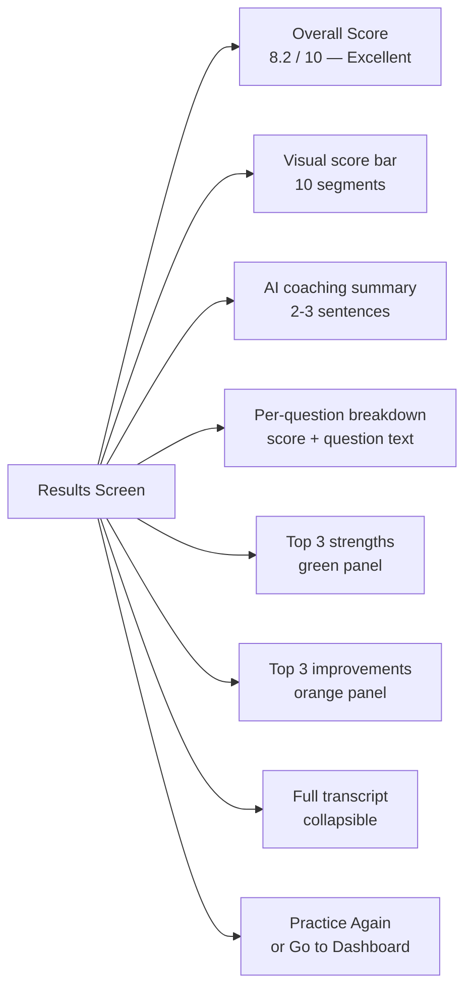

---

### 6.4 Live Proctored Interview

A recruiter-scheduled, biometric-verified, AI-evaluated voice interview with anti-cheat monitoring.

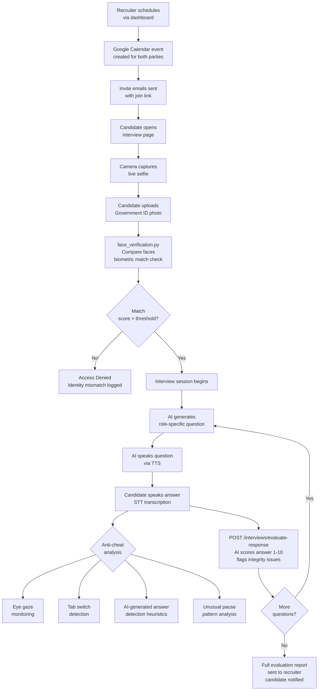

---

### 6.5 Messaging & Ecosystem Network

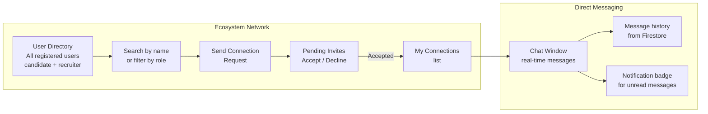

**Connection flow:**
1. Candidate finds recruiter (or another candidate) in the directory
2. Sends a connection request → stored in Firestore as `{status: "pending"}`
3. Recipient sees badge on "Pending Invites" tab
4. Accepts → status becomes `"accepted"` → "Chat" button unlocked
5. Either party can now send direct messages
6. Messages stored in `chats/{chatId}/messages` in Firestore

---

## 7. Recruiter Features & Workflows

### Recruiter Dashboard Overview

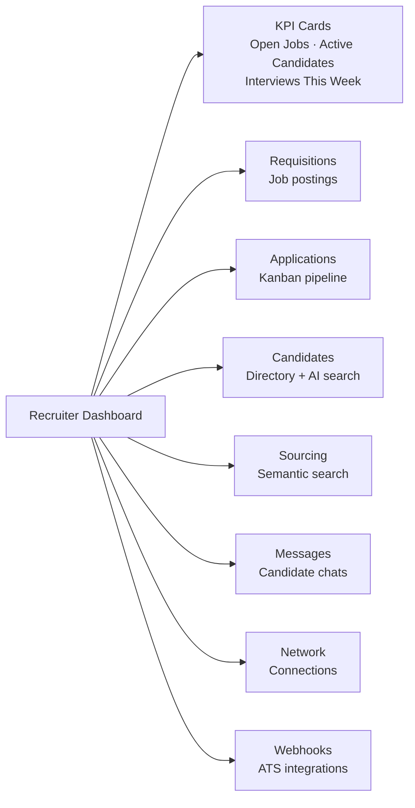

---

### 7.1 Job Requisitions & Pipeline

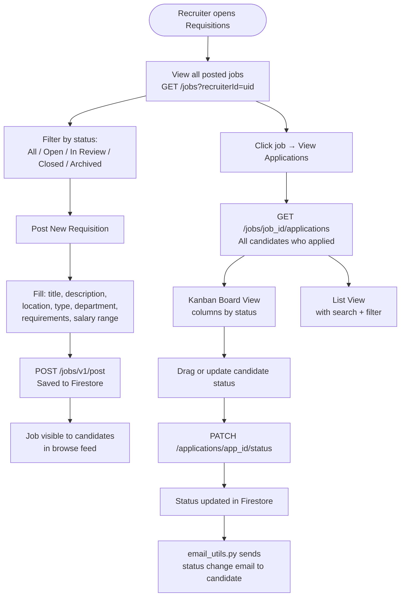

**Status flow:**
```
Applied ──► In Review ──► Interviewed ──► Shortlisted ──► Hired
                                       ↘
                                        Rejected (email sent at any stage)
```

---

### 7.2 Candidate Management

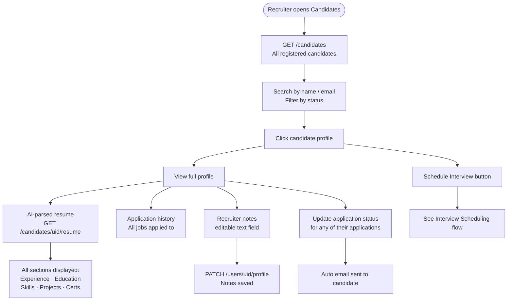

---

### 7.3 AI Copilot Candidate Search

Natural language candidate sourcing — describe the person you're looking for in plain English.

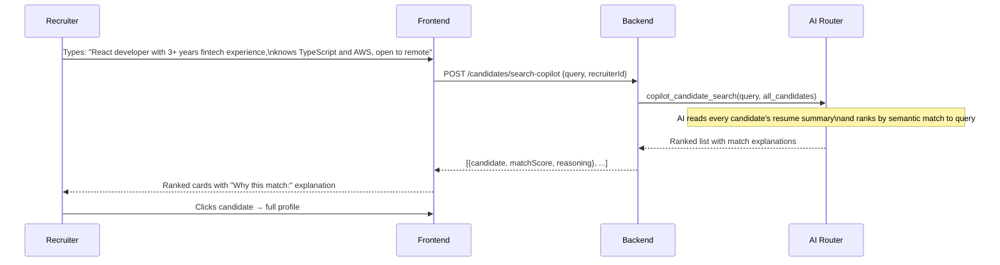

**How it works internally:**
1. All candidate profiles are loaded from Firestore (name, summary, skills, experience)
2. The query and candidate summaries are sent to the AI in a single prompt
3. AI returns a ranked list with a one-sentence match explanation for each candidate
4. Results shown as profile cards with match reasoning visible

---

### 7.4 Interview Scheduling

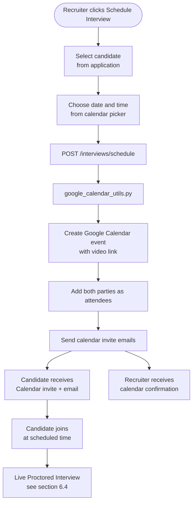

---

### 7.5 Webhooks & ATS Integration

Recruiters can register external endpoints to receive real-time events when application statuses change — enabling sync with external ATS systems (Greenhouse, Lever, Workday, etc.).

```mermaid
flowchart TD
    A([Recruiter registers webhook URL]) --> B[POST /webhooks/subscribe\n{url, description}]
    B --> C[URL stored in Firestore\nwebhook subscriptions]

    D([Application status changes]) --> E[POST /applications/app_id/status]
    E --> F[Update Firestore]
    F --> G[Trigger webhook event]
    G --> H[POST to registered URL\n{event: status_change, application, candidate, job}]

    I([Recruiter tests webhook]) --> J[POST /webhooks/test-ping\n{url}]
    J --> K[Backend pings the URL\nwith sample payload]
    K --> L{Response?}
    L -- 200 → M[Show ✓ Success badge]
    L -- Error → N[Show ✗ Failed badge]
```

---

## 8. Backend API Reference

All endpoints are prefixed with `/api`. Authentication uses `Bearer mock_token_for_{uid}` header.

### Resume Endpoints

| Method | Endpoint | Description |
|---|---|---|
| `POST` | `/parse-resume` | Upload PDF/DOCX → AI-parsed JSON resume |
| `POST` | `/enhance-section` | Rewrite a resume section in 3 AI variants |
| `POST` | `/generate-summary-suggestions` | Generate 3 professional summary options |
| `POST` | `/generate-elevator-pitch` | Create 30-second spoken pitch from resume |
| `POST` | `/generate-pdf` | Export resume as styled PDF |
| `POST` | `/generate-docx` | Export resume as DOCX Word file |

### Job Endpoints

| Method | Endpoint | Description |
|---|---|---|
| `GET` | `/jobs` | List all jobs (filter: `?recruiterId=`, `?status=`) |
| `GET` | `/jobs/<job_id>` | Get single job details |
| `POST` | `/jobs/v1/post` | Create new job posting |
| `PATCH` | `/jobs/<job_id>` | Update job (title, description, status) |
| `POST` | `/jobs/search-semantic` | Semantic job search by natural language query |
| `POST` | `/jobs/<job_id>/apply` | Submit application for a job |
| `GET` | `/jobs/<job_id>/applications` | Get all applications for a specific job |

### Application Endpoints

| Method | Endpoint | Description |
|---|---|---|
| `GET` | `/applications` | List applications (filter: `?recruiterId=` or `?candidateId=`) |
| `GET` | `/applications/<app_id>` | Get single application detail |
| `PATCH` | `/applications/<app_id>/status` | Update status → triggers email notification |
| `POST` | `/grade-resume` | AI ATS score: resume vs job description |
| `POST` | `/generate-cover-letter` | Generate tailored cover letter |

### Interview Endpoints

| Method | Endpoint | Description |
|---|---|---|
| `POST` | `/interviews/verify-identity` | Biometric face comparison (selfie vs ID) |
| `POST` | `/interviews/get-next-question` | Generate next interview question with context |
| `POST` | `/interviews/evaluate-response` | Score answer + integrity check |
| `POST` | `/interviews/schedule` | Book Google Calendar event + send emails |
| `POST` | `/practice-interview/ai-turn` | AI interviewer conversational turn (voice mode) |
| `POST` | `/practice-interview/final-feedback` | End-of-session holistic evaluation |
| `POST` | `/practice-interview/question` | Generate single practice question (typed mode) |
| `POST` | `/practice-interview/evaluate` | Score single practice answer (typed mode) |

### Candidate & Recruiter Endpoints

| Method | Endpoint | Description |
|---|---|---|
| `GET` | `/candidates` | List all candidates (recruiter only) |
| `GET` | `/candidates/<uid>/resume` | Fetch candidate's structured resume |
| `POST` | `/candidates/search-copilot` | AI semantic candidate search |
| `GET` | `/stats/candidate/<uid>` | Candidate stats (apps sent, interviews, scores) |
| `GET` | `/stats/recruiter/<uid>` | Recruiter stats (jobs posted, pipeline counts) |

### User & Auth Endpoints

| Method | Endpoint | Description |
|---|---|---|
| `POST` | `/users/register` | Create user profile in Firestore after Firebase signup |
| `GET` | `/users` | Search users directory |
| `PATCH` | `/users/<uid>/profile` | Update profile fields |
| `POST` | `/vault/verify-key` | Live-test an API key against the real provider |
| `POST` | `/vault/wallet/stack` | Encrypt and store a new API key |
| `POST` | `/vault/wallet/remove` | Remove a key from the wallet |

### Messaging & Notifications

| Method | Endpoint | Description |
|---|---|---|
| `GET` | `/chats` | Get all chats for current user |
| `POST` | `/chats` | Create or get existing chat between two users |
| `GET` | `/chats/<chat_id>/messages` | Fetch message history |
| `POST` | `/chats/<chat_id>/messages` | Send a message |
| `GET` | `/notifications` | Get notifications for current user |
| `POST` | `/notifications/read-all` | Mark all notifications as read |

### Connections (Network)

| Method | Endpoint | Description |
|---|---|---|
| `GET` | `/connections` | Get all connections for current user |
| `POST` | `/connections/request` | Send a connection request |
| `POST` | `/connections/<id>/respond` | Accept or decline a request |

### Company Explorer

| Method | Endpoint | Description |
|---|---|---|
| `GET` | `/companies` | List companies (AI-generates missing profiles on demand) |
| `GET` | `/companies/<id>` | Company detail with AI-generated reviews |

### Webhooks

| Method | Endpoint | Description |
|---|---|---|
| `GET` | `/webhooks/subscriptions` | List registered webhook URLs |
| `POST` | `/webhooks/subscribe` | Register a new webhook endpoint |
| `POST` | `/webhooks/test-ping` | Send a test payload to a webhook URL |

---

## 9. Database Schema

All data is stored in **Cloud Firestore** (NoSQL document database).

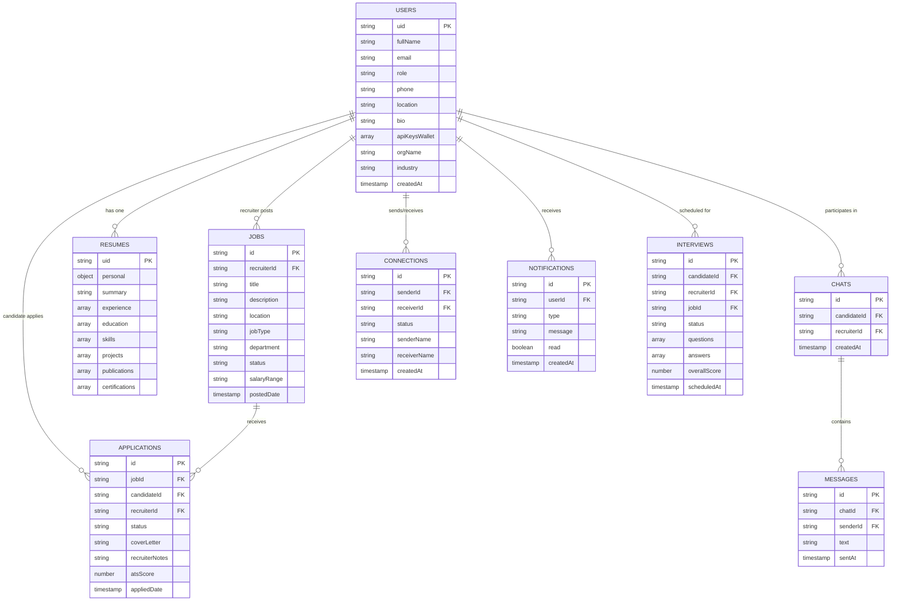

---

## 10. Tech Stack

### Frontend

| Technology | Version | Purpose |
|---|---|---|
| **Next.js** | 15 | Full-stack React framework, App Router, SSR |
| **TypeScript** | 5 | Type safety across all components |
| **Tailwind CSS** | 3 | Utility-first styling |
| **Framer Motion** | 11 | Animations, transitions, waveform effects |
| **Sonner** | — | Toast notifications |
| **Lucide React** | — | Icon library |
| **Web Speech API** | Browser | Speech-to-text (candidate mic input) |
| **SpeechSynthesis API** | Browser | Text-to-speech (AI voice output) |

### Backend

| Technology | Version | Purpose |
|---|---|---|
| **Flask** | 3.x | Python web framework |
| **Gunicorn** | — | WSGI server for production |
| **cryptography** | — | Fernet symmetric encryption for API keys |
| **requests** | — | HTTP client for AI provider APIs |
| **PyMuPDF / pdfminer** | — | PDF text extraction |
| **python-docx** | — | DOCX generation and parsing |
| **google-auth** | — | Firebase Admin SDK auth |
| **google-cloud-firestore** | — | Firestore database client |

### Infrastructure

| Service | Purpose |
|---|---|
| **Google Cloud Run** | Serverless container hosting (auto-scales to zero) |
| **Google Cloud Build** | CI/CD — builds Docker images on push |
| **Google Artifact Registry** | Docker image storage |
| **Firebase Authentication** | User signup, login, Google OAuth |
| **Cloud Firestore** | Primary database |
| **Firebase Storage** | Resume file uploads |
| **Google Calendar API** | Interview scheduling |
| **SMTP** | Email notifications |

---

## 11. Project Structure

```
CareerCraft/
├── README.md                           ← You are here
├── deploy.ps1                          ← One-command Cloud Run deploy script
│
├── web/                                ← Main web application
│   ├── cloudbuild.yaml                 ← Cloud Build config for frontend
│   │
│   ├── src/
│   │   ├── app/                        ← Next.js App Router pages
│   │   │   ├── page.tsx                ← Landing page (hero, features, testimonials)
│   │   │   ├── layout.tsx              ← Root layout (fonts, providers)
│   │   │   ├── globals.css             ← Global styles + Tailwind directives
│   │   │   │
│   │   │   ├── onboarding/
│   │   │   │   └── page.tsx            ← Role selection + profile setup wizard
│   │   │   │
│   │   │   ├── signup/
│   │   │   │   └── page.tsx            ← Sign up / sign in page
│   │   │   │
│   │   │   ├── candidate/
│   │   │   │   ├── dashboard/          ← Candidate home: pipeline, quick actions
│   │   │   │   ├── resume-builder/     ← AI resume editor with sections
│   │   │   │   ├── jobs/
│   │   │   │   │   ├── page.tsx        ← Job browse + semantic search
│   │   │   │   │   └── [id]/page.tsx   ← Job detail: ATS grade + apply
│   │   │   │   ├── interview/
│   │   │   │   │   ├── page.tsx        ← Live proctored interview room
│   │   │   │   │   └── practice/
│   │   │   │   │       └── page.tsx    ← AI voice practice interview
│   │   │   │   ├── messages/           ← Direct messaging with recruiters
│   │   │   │   ├── network/            ← User directory + connections
│   │   │   │   └── profile/            ← Settings + API key vault UI
│   │   │   │
│   │   │   ├── recruiter/
│   │   │   │   ├── dashboard/          ← Recruiter home: KPIs + quick links
│   │   │   │   ├── requisitions/
│   │   │   │   │   ├── page.tsx        ← Job postings list
│   │   │   │   │   ├── new/page.tsx    ← Create new job posting
│   │   │   │   │   ├── [id]/page.tsx   ← Edit job details
│   │   │   │   │   └── [id]/applications/page.tsx ← Kanban applicant board
│   │   │   │   ├── candidates/
│   │   │   │   │   ├── page.tsx        ← Candidate directory
│   │   │   │   │   └── [id]/page.tsx   ← Full candidate profile + notes
│   │   │   │   ├── applications/
│   │   │   │   │   ├── page.tsx        ← All applications across jobs
│   │   │   │   │   └── [id]/page.tsx   ← Single application detail
│   │   │   │   ├── sourcing/           ← AI Copilot semantic candidate search
│   │   │   │   ├── messages/           ← Direct messaging with candidates
│   │   │   │   ├── network/            ← Professional network connections
│   │   │   │   ├── profile/            ← Org settings + API key vault
│   │   │   │   └── webhooks/           ← ATS webhook management
│   │   │   │
│   │   │   └── companies/
│   │   │       ├── page.tsx            ← Company explorer with search
│   │   │       └── [id]/page.tsx       ← Company detail, reviews, salary data
│   │   │
│   │   ├── components/
│   │   │   ├── layout/
│   │   │   │   ├── CandidateSidebar.tsx ← Candidate nav (all pages)
│   │   │   │   ├── CandidateLayout.tsx
│   │   │   │   ├── RecruiterLayout.tsx
│   │   │   │   └── Topbar.tsx
│   │   │   ├── recruiter/
│   │   │   │   ├── RequisitionCard.tsx
│   │   │   │   └── CandidateCard.tsx
│   │   │   ├── LoginModal.tsx
│   │   │   ├── Navbar.tsx
│   │   │   └── Hero.tsx
│   │   │
│   │   ├── contexts/
│   │   │   ├── AuthContext.tsx          ← Firebase auth state + user profile
│   │   │   └── LoginModalContext.tsx
│   │   │
│   │   └── lib/
│   │       ├── firebase.ts             ← Firebase client initialisation
│   │       └── api.ts                  ← API_BASE URL (env-aware)
│   │
│   └── backend/
│       ├── Dockerfile                  ← Container image definition
│       ├── app.py                      ← Flask app factory + blueprint registration
│       ├── routes.py                   ← All ~50 API endpoint handlers
│       ├── ai_router.py                ← BYOK multi-provider AI router
│       ├── ollama_utils.py             ← All AI feature functions
│       ├── firebase_utils.py           ← Firestore CRUD helpers
│       ├── vault_utils.py              ← Fernet encrypt/decrypt for API keys
│       ├── file_parser.py              ← PDF / DOCX text extraction
│       ├── document_generator.py       ← PDF / DOCX resume export
│       ├── face_verification.py        ← Biometric face comparison
│       ├── email_utils.py              ← Email notification sender
│       ├── google_calendar_utils.py    ← Calendar event creation
│       └── requirements.txt
│
├── mobile/                             ← Flutter mobile app
└── android application/                ← Android native app
```

---

## 12. Local Development Setup

### Prerequisites

| Requirement | Version | Notes |
|---|---|---|
| Node.js | 18+ | `node --version` |
| Python | 3.11+ | `python --version` |
| Firebase project | — | Firestore + Auth + Storage enabled |
| API key | Any provider | Gemini free tier works |
| Chrome or Edge | Latest | Required for Web Speech API |

### Step 1 — Clone and install frontend

```bash
git clone https://github.com/Sree8778/CareerCraft.git
cd "CareerCraft/web"
npm install
```

### Step 2 — Configure frontend environment

Create `web/.env.local`:

```env
NEXT_PUBLIC_FIREBASE_API_KEY=AIzaSy...
NEXT_PUBLIC_FIREBASE_AUTH_DOMAIN=your-project.firebaseapp.com
NEXT_PUBLIC_FIREBASE_PROJECT_ID=your-project-id
NEXT_PUBLIC_FIREBASE_STORAGE_BUCKET=your-project.appspot.com
NEXT_PUBLIC_FIREBASE_MESSAGING_SENDER_ID=123456789
NEXT_PUBLIC_FIREBASE_APP_ID=1:123456789:web:abc123
NEXT_PUBLIC_FIREBASE_MEASUREMENT_ID=G-XXXXXXXX
NEXT_PUBLIC_API_BASE_URL=http://127.0.0.1:5000/api
```

### Step 3 — Configure backend

```bash
cd web/backend

# Create virtual environment
python -m venv .venv

# Activate (Windows)
.venv\Scripts\activate
# Activate (Mac/Linux)
source .venv/bin/activate

# Install dependencies
pip install -r requirements.txt
```

Place your Firebase service account JSON at `web/backend/credentials.json` (download from Firebase Console → Project Settings → Service Accounts).

### Step 4 — Run both services

**Terminal 1 — Backend:**
```bash
cd web/backend
.venv\Scripts\activate
python app.py
# Running on http://127.0.0.1:5000
```

**Terminal 2 — Frontend:**
```bash
cd web
npm run dev
# Running on http://localhost:3000
```

### Step 5 — Add an API key

1. Sign up at `http://localhost:3000`
2. Complete onboarding (choose Candidate or Recruiter)
3. Go to Profile → Settings → API Key Vault
4. Add a Gemini API key (free at [aistudio.google.com](https://aistudio.google.com))
5. All AI features unlock immediately

---

## 13. Production Deployment

CareerCraft deploys to **Google Cloud Run** — two separate services (frontend container and backend container) both auto-scaling to zero when idle.

### Prerequisites

```bash
# Install Google Cloud CLI
# https://cloud.google.com/sdk/docs/install

gcloud auth login
gcloud config set project YOUR_PROJECT_ID
```

### Deploy (one command)

```bash
# Full deploy — backend + frontend (~15 minutes)
.\deploy.ps1

# Frontend only — when only frontend files changed (~7 minutes)
.\deploy.ps1 -FrontendOnly
```

### Deployment pipeline

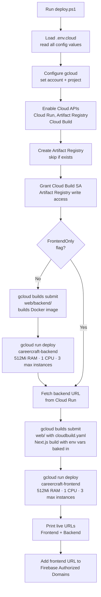

### What gets deployed

| Service | Image | Memory | CPU | Max instances |
|---|---|---|---|---|
| `careercraft-frontend` | Next.js SSR container | 512 Mi | 1 | 3 |
| `careercraft-backend` | Flask + Gunicorn container | 512 Mi | 1 | 3 |

---

## 14. Environment Variables

### Frontend (`.env.local` for dev / Cloud Build substitutions for prod)

| Variable | Required | Description |
|---|---|---|
| `NEXT_PUBLIC_API_BASE_URL` | Yes | Backend URL — `http://127.0.0.1:5000/api` locally, Cloud Run URL in prod |
| `NEXT_PUBLIC_FIREBASE_API_KEY` | Yes | Firebase web API key |
| `NEXT_PUBLIC_FIREBASE_AUTH_DOMAIN` | Yes | Firebase auth domain |
| `NEXT_PUBLIC_FIREBASE_PROJECT_ID` | Yes | Firestore project ID |
| `NEXT_PUBLIC_FIREBASE_STORAGE_BUCKET` | Yes | Firebase Storage bucket |
| `NEXT_PUBLIC_FIREBASE_MESSAGING_SENDER_ID` | Yes | FCM sender ID |
| `NEXT_PUBLIC_FIREBASE_APP_ID` | Yes | Firebase app ID |
| `NEXT_PUBLIC_FIREBASE_MEASUREMENT_ID` | No | Google Analytics ID |

### Backend (Cloud Run environment variables)

| Variable | Required | Description |
|---|---|---|
| `BACKEND_VAULT_MASTER_KEY` | Yes | Fernet master key for encrypting user API keys. Generate with `python -c "from cryptography.fernet import Fernet; print(Fernet.generate_key().decode())"` |
| `GEMINI_API_KEY` | No | Optional server-side Gemini key (not used for BYOK features) |

---

## 15. Security Architecture

```mermaid
flowchart TD
    subgraph Client ["Client Security"]
        FireAuth[Firebase Auth\nJWT tokens]
        HTTPS[HTTPS only\nTLS 1.3]
    end

    subgraph Transport ["Transport Security"]
        CloudRun[Cloud Run\nManaged TLS termination]
    end

    subgraph AppSec ["Application Security"]
        AuthHeader[Authorization header\nBearer mock_token_for_uid]
        UID[UID extracted from token\nall queries scoped to user]
    end

    subgraph DataSec ["Data Security"]
        Fernet[API keys encrypted\nFernet symmetric encryption]
        MasterKey[Master key stored only\nin Cloud Run env vars\nnever in code or git]
        Firestore[Firestore security rules\nuser can only read own data]
        GitIgnore[.env.cloud gitignored\ncredentials.json gitignored]
    end

    Client --> Transport
    Transport --> AppSec
    AppSec --> DataSec
```

**Key security decisions:**

1. **API keys never stored in plaintext** — All user API keys are Fernet-encrypted before writing to Firestore. The master key exists only as a Cloud Run environment variable.

2. **BYOK means zero shared secrets** — No single API key serves all users. A breach of one user's key does not affect others.

3. **Firestore security rules** — Each collection is scoped so users can only read and write their own documents.

4. **Git hygiene** — `.env.cloud`, `credentials.json`, and `.env.local` are all in `.gitignore`. No secrets have ever been committed.

5. **Short-lived Cloud Run containers** — Containers scale to zero when idle. No persistent server processes that could be compromised while idle.

---

## Contributing

```bash
# 1. Fork the repository
# 2. Create a feature branch
git checkout -b feat/my-new-feature

# 3. Make changes, test locally
npm run dev  # frontend
python app.py  # backend

# 4. Commit
git commit -m "feat: add my new feature"

# 5. Push and open a PR
git push origin feat/my-new-feature
```

---

*Built with Next.js 15, Flask, Firebase, and Google Cloud Run.*
*AI powered by Gemini, OpenAI, NVIDIA NIM, Groq, and Claude — using your own keys.*
