# CareerCraft — AI-Powered Job Recruitment Portal

> A full-stack, production-deployed recruitment platform with end-to-end AI automation for candidates and recruiters. Bring Your Own Key (BYOK) architecture — every AI feature runs on the user's own API keys with zero shared cost.

**Live Demo:** https://careercraft-frontend-brkwttcaqq-uc.a.run.app

---

## Table of Contents

- [Overview](#overview)
- [System Architecture](#system-architecture)
- [User Roles & Flows](#user-roles--flows)
  - [Candidate Flow](#candidate-flow)
  - [Recruiter Flow](#recruiter-flow)
- [Feature Modules](#feature-modules)
  - [Resume Builder](#1-ai-resume-builder)
  - [Job Search & Application](#2-job-search--application)
  - [AI Practice Interview](#3-ai-voice-practice-interview)
  - [Live Proctored Interview](#4-live-proctored-interview)
  - [Recruiter Copilot](#5-recruiter-ai-copilot)
  - [Messaging & Network](#6-messaging--ecosystem-network)
  - [BYOK API Key Vault](#7-byok-api-key-vault)
- [AI Router — Multi-Provider Fallback](#ai-router--multi-provider-fallback)
- [Tech Stack](#tech-stack)
- [Project Structure](#project-structure)
- [Local Development](#local-development)
- [Deployment](#deployment)
- [Environment Variables](#environment-variables)

---

## Overview

CareerCraft automates the full hiring lifecycle — from resume parsing and job matching to AI voice interviews and offer notifications — for both candidates and recruiters.

```
Candidate                          Platform                         Recruiter
─────────                          ────────                         ─────────
Upload Resume ──► AI Parse ──► Structured Profile ──► Semantic Match ──► Recruiter View
Apply to Job  ──► Cover Letter Gen ──► ATS Score ──► Application Pipeline
Practice Interview (Voice AI) ──► Score & Coaching
Live Interview (Proctored) ──► Evaluation ──► Status Update ──► Email Notify
```

---

## System Architecture

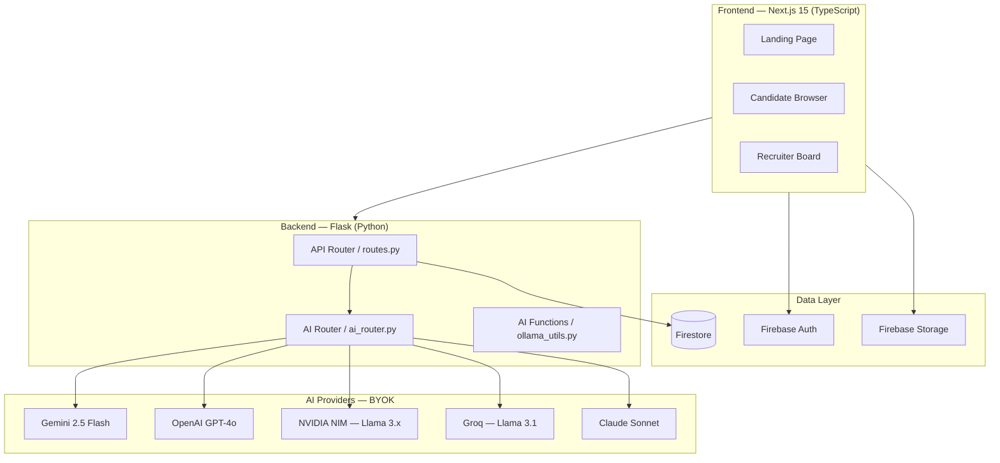

---

## User Roles & Flows

### Candidate Flow

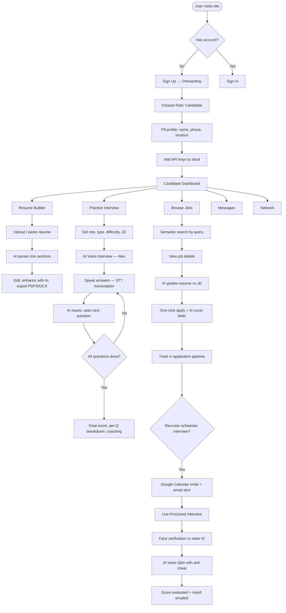

---

### Recruiter Flow

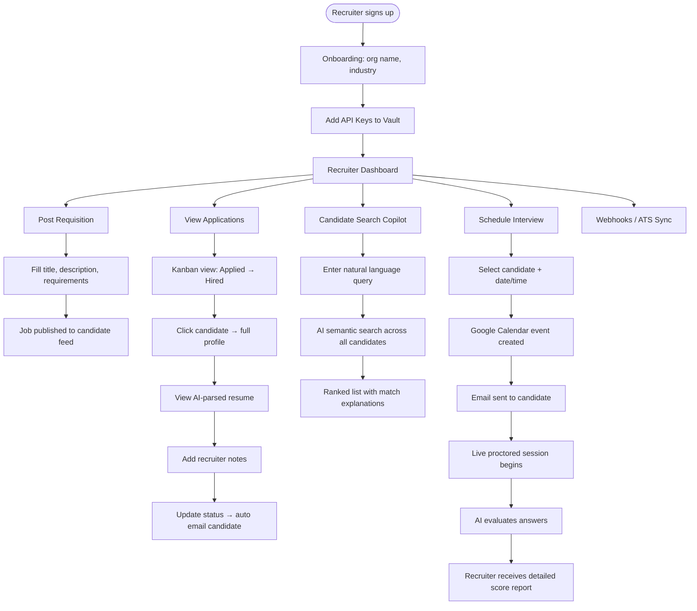

---

## Feature Modules

### 1. AI Resume Builder

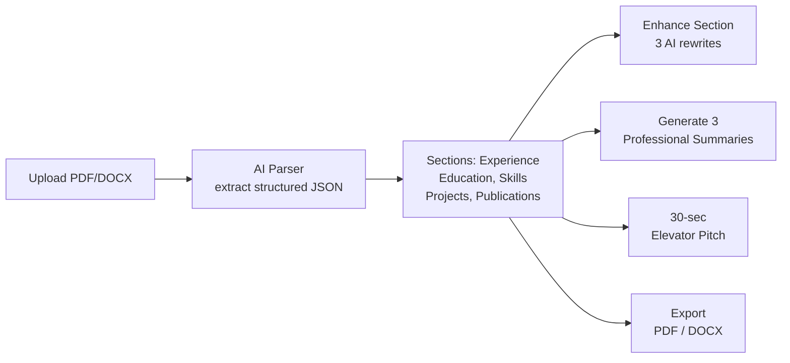

- Parses any resume format (PDF, DOCX, plain text) into structured sections
- AI rewrites any section in 3 style variants (concise / detailed / impactful)
- Generates professional summaries and a 30-second elevator pitch
- Exports to polished PDF or DOCX using branded template

---

### 2. Job Search & Application

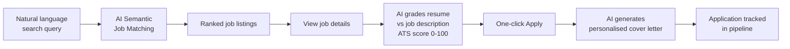

- Semantic search understands intent, not just keywords
- ATS score shows which resume keywords are missing
- Cover letter is generated from the candidate's actual resume content and the specific JD
- Application status updates trigger email notifications at every stage

---

### 3. AI Voice Practice Interview

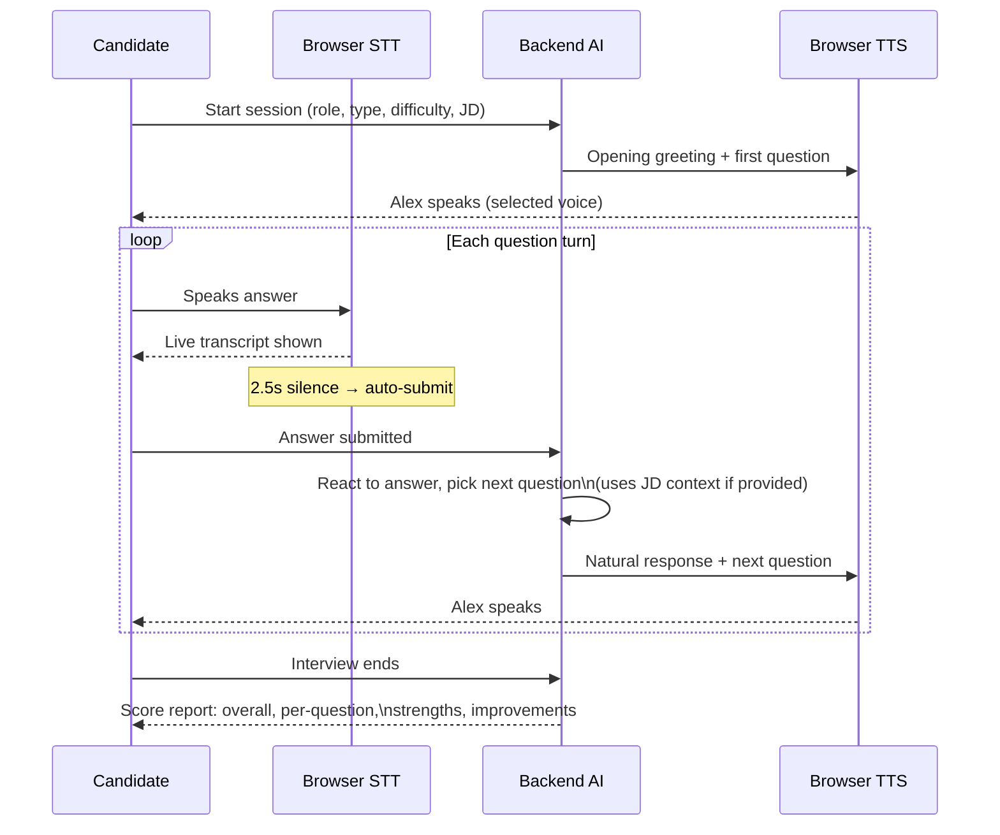

**Key features:**
- Full voice experience — candidate speaks, AI responds in a chosen voice
- Job description field tailors every question to the actual role
- 4 interview types: Technical, Behavioral, HR, Mixed
- 3 difficulty levels: Junior, Mid, Senior
- 3, 5, or 8 questions per session
- Chrome SpeechSynthesis keepalive prevents mid-interview audio dropouts
- Ref-based state prevents stale-closure context loss across turns
- Final report: overall score /10, per-question breakdown, coaching tips

---

### 4. Live Proctored Interview

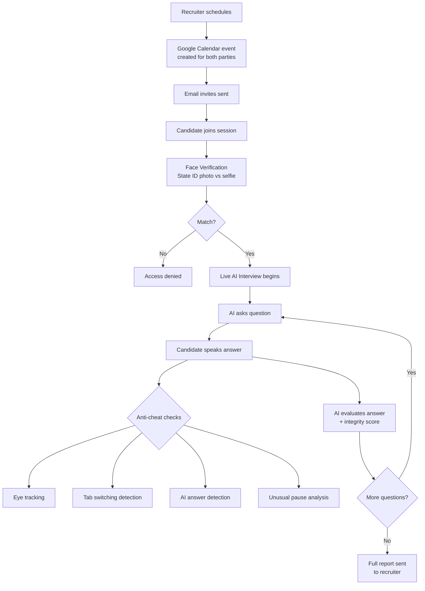

---

### 5. Recruiter AI Copilot

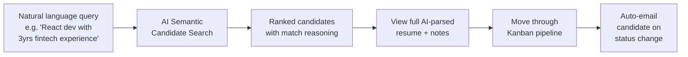

---

### 6. Messaging & Ecosystem Network

- **Direct messaging** between candidates and recruiters after a connection is accepted
- **Connection system**: send / accept / decline connection requests
- **Network directory**: searchable list of all registered users, filterable by role
- **Real-time chat** stored in Firestore, accessible from both candidate and recruiter dashboards

---

### 7. BYOK API Key Vault

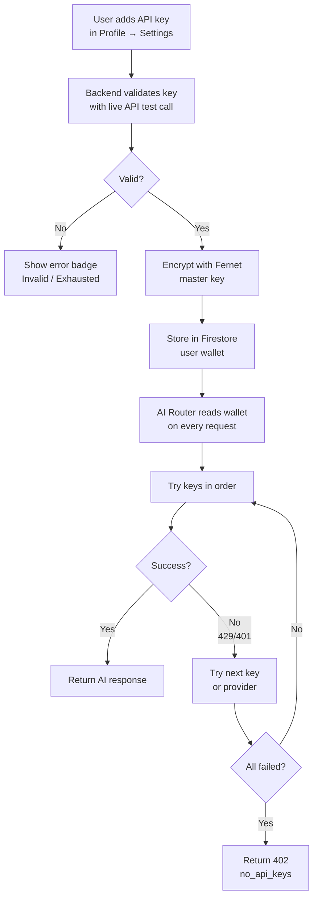

**Supported providers:**
| Provider | Light Model | Heavy Model |
|---|---|---|
| Gemini | gemini-2.5-flash | gemini-2.5-flash |
| OpenAI | gpt-4o-mini | gpt-4o |
| NVIDIA NIM | llama-3.1-8b-instruct | llama-3.3-70b-instruct |
| Groq | llama-3.1-8b-instant | llama-3.1-70b-versatile |
| Claude | claude-haiku-4-5 | claude-sonnet-4-6 |

Keys are **Fernet-encrypted at rest** in Firestore. The master encryption key never leaves Cloud Run environment variables.

---

## AI Router — Multi-Provider Fallback

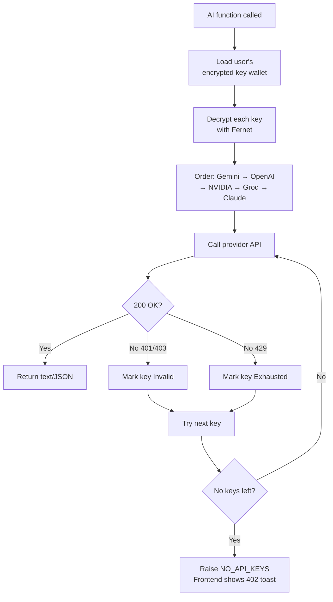

Every AI feature in the app (resume parsing, cover letters, interview questions, semantic search, company profiles) runs through this router. If one key rate-limits, it falls through to the next automatically.

---

## Tech Stack

| Layer | Technology |
|---|---|
| **Frontend** | Next.js 15, TypeScript, Tailwind CSS, Framer Motion |
| **Backend** | Flask (Python), Gunicorn |
| **Database** | Firestore (NoSQL) |
| **Auth** | Firebase Authentication (email/password, Google OAuth) |
| **Storage** | Firebase Storage (resume files) |
| **AI** | Gemini 2.5 Flash, OpenAI GPT-4o, NVIDIA NIM Llama 3.x, Groq, Claude |
| **Voice STT** | Web Speech API (browser-native, Chrome/Edge) |
| **Voice TTS** | Web SpeechSynthesis API (browser-native, user-selectable voice) |
| **Face Verify** | Firebase Vision / custom face comparison |
| **Calendar** | Google Calendar API |
| **Email** | SMTP / email_utils |
| **Deployment** | Google Cloud Run (containerised, auto-scaling) |
| **CI/CD** | Google Cloud Build |
| **Image Registry** | Google Artifact Registry |

---

## Project Structure

```
Job portal project/
├── web/
│   ├── src/
│   │   ├── app/
│   │   │   ├── page.tsx                    # Landing page
│   │   │   ├── onboarding/                 # Role selection & profile setup
│   │   │   ├── candidate/
│   │   │   │   ├── dashboard/              # Candidate home
│   │   │   │   ├── resume-builder/         # AI resume editor
│   │   │   │   ├── jobs/                   # Browse & apply to jobs
│   │   │   │   ├── interview/              # Live proctored interview
│   │   │   │   ├── interview/practice/     # AI voice practice interview
│   │   │   │   ├── messages/               # Chat with recruiters
│   │   │   │   ├── network/                # Professional directory
│   │   │   │   └── profile/                # Settings & API key vault
│   │   │   ├── recruiter/
│   │   │   │   ├── dashboard/              # Recruiter home + KPIs
│   │   │   │   ├── requisitions/           # Job postings management
│   │   │   │   ├── candidates/             # Candidate directory + AI copilot
│   │   │   │   ├── applications/           # Application kanban pipeline
│   │   │   │   ├── messages/               # Chat with candidates
│   │   │   │   ├── network/                # Professional directory
│   │   │   │   ├── sourcing/               # Semantic candidate sourcing
│   │   │   │   ├── profile/                # Org settings
│   │   │   │   └── webhooks/               # ATS integration webhooks
│   │   │   └── companies/                  # Company explorer
│   │   ├── components/
│   │   │   └── layout/                     # Sidebars, nav, shared UI
│   │   ├── contexts/
│   │   │   └── AuthContext.tsx             # Firebase auth state
│   │   └── lib/
│   │       ├── firebase.ts                 # Firebase client config
│   │       └── api.ts                      # API base URL
│   ├── backend/
│   │   ├── app.py                          # Flask app factory
│   │   ├── routes.py                       # All API endpoints (~50 routes)
│   │   ├── ai_router.py                    # BYOK multi-provider AI router
│   │   ├── ollama_utils.py                 # All AI feature functions
│   │   ├── firebase_utils.py               # Firestore helpers
│   │   ├── vault_utils.py                  # Fernet encryption/decryption
│   │   ├── email_utils.py                  # Email notifications
│   │   ├── google_calendar_utils.py        # Calendar scheduling
│   │   ├── face_verification.py            # Biometric ID check
│   │   ├── file_parser.py                  # PDF/DOCX text extraction
│   │   ├── document_generator.py           # PDF/DOCX export
│   │   └── requirements.txt
│   ├── cloudbuild.yaml                     # Cloud Build frontend config
│   └── deploy.ps1                          # One-command deploy script
├── mobile/                                 # Flutter mobile app
└── android application/                    # Android native app
```

---

## Local Development

### Prerequisites

- Node.js 18+
- Python 3.11+
- Firebase project with Firestore and Authentication enabled
- At least one AI provider API key (Gemini recommended — free tier available)

### Frontend

```bash
cd web
npm install
cp .env.local.example .env.local   # fill in Firebase config + backend URL
npm run dev
# → http://localhost:3000
```

### Backend

```bash
cd web/backend
python -m venv .venv
.venv\Scripts\activate          # Windows
# source .venv/bin/activate     # Mac/Linux
pip install -r requirements.txt
python app.py
# → http://127.0.0.1:5000
```

### Required `.env.local` values

```env
NEXT_PUBLIC_FIREBASE_API_KEY=
NEXT_PUBLIC_FIREBASE_AUTH_DOMAIN=
NEXT_PUBLIC_FIREBASE_PROJECT_ID=
NEXT_PUBLIC_FIREBASE_STORAGE_BUCKET=
NEXT_PUBLIC_FIREBASE_MESSAGING_SENDER_ID=
NEXT_PUBLIC_FIREBASE_APP_ID=
NEXT_PUBLIC_API_BASE_URL=http://127.0.0.1:5000/api
```

---

## Deployment

The project deploys to **Google Cloud Run** via a single PowerShell script.

```powershell
# Full deploy (backend + frontend) — ~15 min
.\deploy.ps1

# Frontend only — ~7 min (use when only frontend files changed)
.\deploy.ps1 -FrontendOnly
```

**What the script does:**

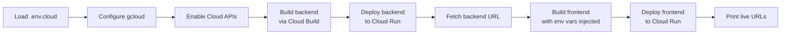

### `.env.cloud` required values

```env
GCP_PROJECT_ID=your-gcp-project-id
GCP_REGION=us-central1
GEMINI_API_KEY=                          # server-side fallback key (optional)
NEXT_PUBLIC_FIREBASE_API_KEY=
NEXT_PUBLIC_FIREBASE_AUTH_DOMAIN=
NEXT_PUBLIC_FIREBASE_PROJECT_ID=
NEXT_PUBLIC_FIREBASE_STORAGE_BUCKET=
NEXT_PUBLIC_FIREBASE_MESSAGING_SENDER_ID=
NEXT_PUBLIC_FIREBASE_APP_ID=
NEXT_PUBLIC_FIREBASE_MEASUREMENT_ID=
BACKEND_VAULT_MASTER_KEY=               # Fernet key for API key encryption
```

> **Security:** Never commit `.env.cloud` or `backend/credentials.json` to git. Both are in `.gitignore`.

---

## Environment Variables

| Variable | Where used | Description |
|---|---|---|
| `NEXT_PUBLIC_API_BASE_URL` | Frontend | Backend URL (auto-set by deploy script) |
| `NEXT_PUBLIC_FIREBASE_*` | Frontend | Firebase client config |
| `BACKEND_VAULT_MASTER_KEY` | Backend Cloud Run | Fernet master key for API key encryption |
| `GEMINI_API_KEY` | Backend Cloud Run | Optional server-side Gemini key |

---

## Key Design Decisions

**BYOK (Bring Your Own Key)** — Users supply their own AI provider API keys. The platform never charges for AI usage and scales to any number of users without shared API cost. Keys are encrypted with Fernet before storage.

**Multi-provider fallback** — If one AI provider rate-limits or fails, the router automatically tries the next key/provider. Candidates and recruiters never see an error unless all their keys are exhausted.

**Browser-native voice** — The practice interview uses the Web Speech API for both STT (speech-to-text) and TTS (text-to-speech). No external voice service required, no additional cost, works offline with local voices.

**Ref-based state in React** — The interview room avoids stale closure bugs by storing mutable turn state in `useRef` and routing all silence-timer callbacks through a `submitRef` that always points to the current function.

---

*Built with Next.js, Flask, Firebase, and Google Cloud Run.*
